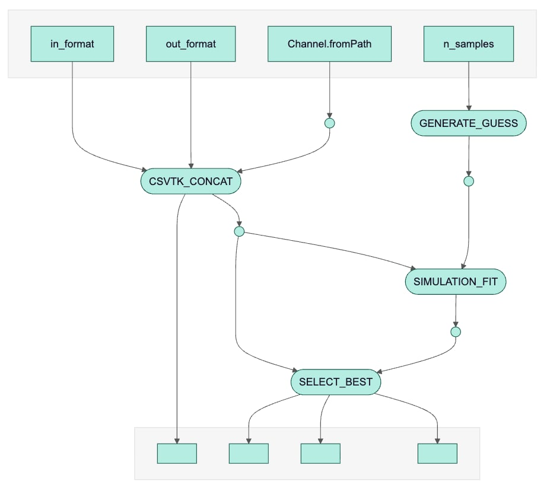

# EPO Receptor Parameter Estimation Pipeline

## Overview

This is a Nextflow pipeline for maximum likelihood parameter estimation of EPO receptor dynamics, based on the dynamical model developed by [Raue et al. (PLOS ONE 2013)](https://doi.org/10.1371/journal.pone.0074335). It generates random parameter guesses from Latin hypercube sampling, runs ODE-based model simulations, selects best fit using the experimental data, and produces relevant informative plots (distribution of likelihoods, best fit vs data).

## Setup

This pipeline was set up on the Gent cluster of the VSC. Load Nextflow and set environment variables:

```bash
module load Nextflow/24.04.2
export APPTAINER_CACHEDIR=${VSC_SCRATCH}/.apptainer_cache
export APPTAINER_TMPDIR=${VSC_SCRATCH}/.apptainer_tmp
mkdir ${VSC_SCRATCH}/.apptainer_tmp
mkdir ${VSC_SCRATCH}/.apptainer_cache
```

**Tested on donphan (interactive/debug) cluster with 1 node, 8 cores. Runtime: ~3 min for 100 samples.**

## Instructions
The only current parameter is the number of parameter samples (guesses) to generate, that you can access from the command line using '--n_samples'.
```bash
nextflow run main.nf --n_samples <number>
```

## Input Files

**`data/*.csv`** - Time series measurements:
```csv
time_points,epo_medium,epo_surf,epo_cells
0.0,1000.0,0.0,0.0
10.0,950.0,5.2,12.1
...
```
They are expected to be from the same experiment. The first Process merge them all into a single CSV file using `CSVTK_CONCAT` from nf_core.

## Output Files

**`results/`**
```
├── all_fits.csv              # All parameter fits + likelihoods
└── plots/
    ├── best_phi.json         # Best 9 parameters
    ├── objective_distribution.png
    └── best_fit.png          # 3-panel: data vs best fit
    
```

## Workflow
the input are the number of samples, which is used to generate the random parameter samples (guess), as well as the date time-series in csv format. They are concatenated together in one unified csv format. 

The data and the parameter samples are then used to simulate the dynamical model and compute the likelihood. 

At the end, the best parameter sample is selected and key plots are created as output to this pipeline. 



## Modules

**CSVTK_CONCAT** (nf-core) - Combines time series CSVs  
**GENERATE_GUESS** - (custom) Creates random φ parameter guesses as JSON files, using python script 'generate_guess.py'
**SIMULATION_FIT** - (custom) Computes negative log-likelihood (solve_ivp + heteroscedastic errors), using python script 'simulation_fit.py'
**SELECT_BEST** - (custom) Finds minimum NLL parameters + generates plots, using python script 'select_best.py'

The last 3 modules mentioned above run using a custom Docker image, which is available on DockerHub at [mdagnelie/parameter_estimation](https://hub.docker.com/repository/docker/mdagnelie/parameter_estimation).

## Perspectives

- Add an optimization algorithm to maximize the likelihood of each initial guess (e.g. trust-region)
- Implement MCMC sampling for parameter uncertainty
- Support multiple datasets/experiments
- Support mutiple models - increased modularity